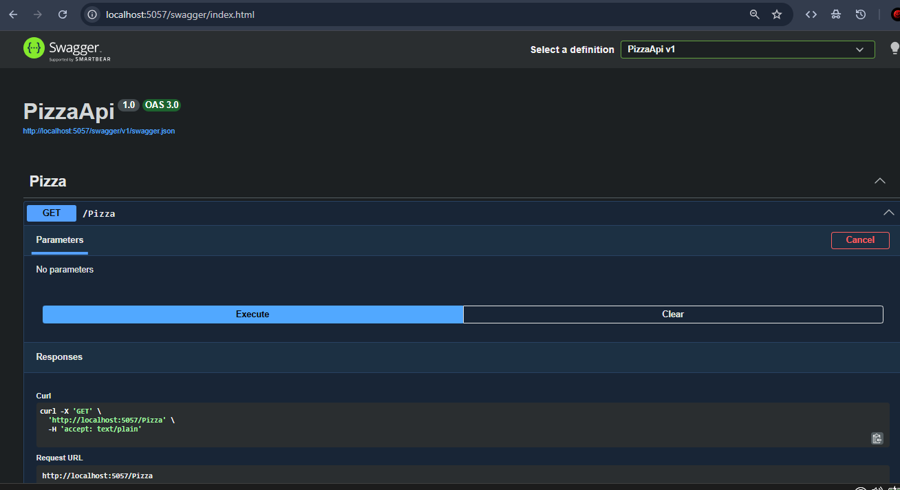
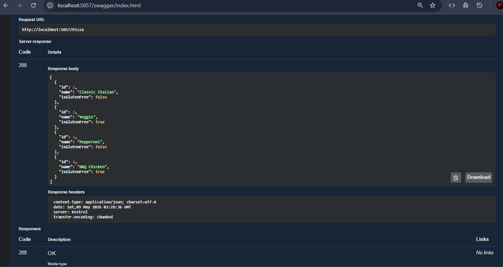
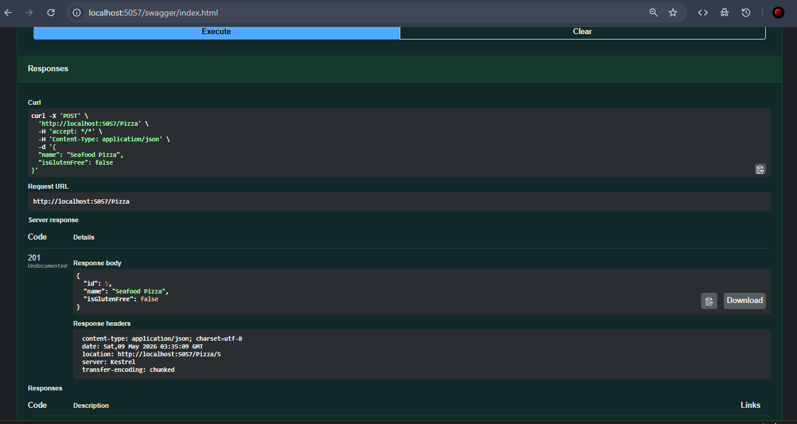
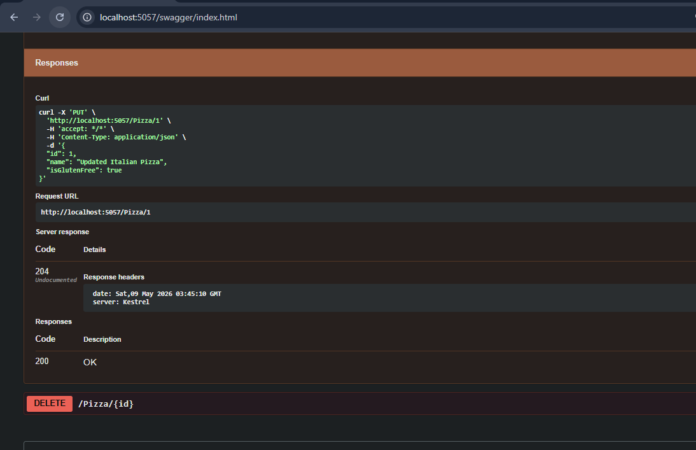
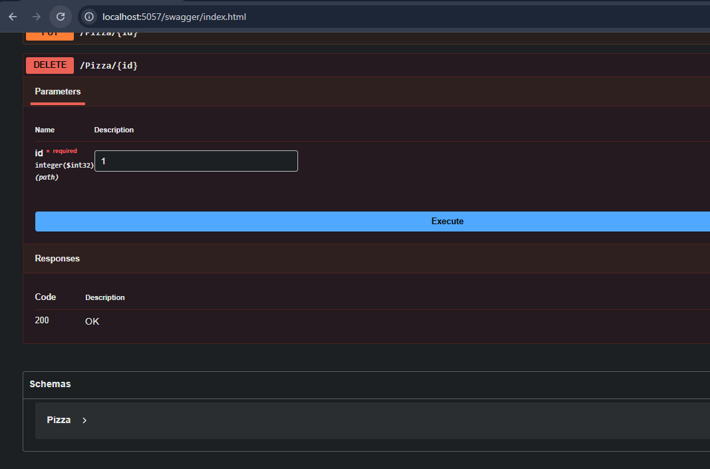
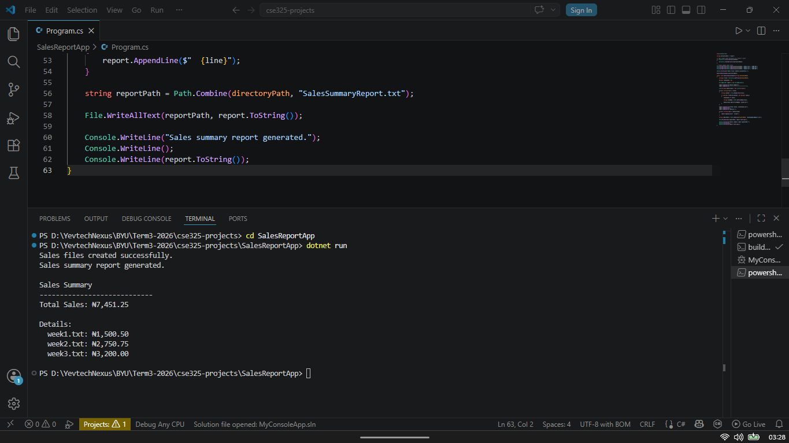

# CSE325 Assignment Notes

## Additional Pizza Record

Added record:

```csharp
new Pizza { Id = 4, Name = "BBQ Chicken", IsGlutenFree = true }
```

---

## Sales Summary Function

```csharp
static void GenerateSalesSummary(string directoryPath)
{
    string[] files = Directory.GetFiles(directoryPath);

    decimal totalSales = 0;

    StringBuilder report = new StringBuilder();

    report.AppendLine("Sales Summary");
    report.AppendLine("----------------------------");

    List<string> detailLines = new List<string>();

    foreach (string file in files)
    {
        string content = File.ReadAllText(file);

        if (decimal.TryParse(content, out decimal sales))
        {
            totalSales += sales;

            string fileName = Path.GetFileName(file);

            detailLines.Add($"{fileName}: {sales:C}");
        }
    }

    report.AppendLine($"Total Sales: {totalSales:C}");
    report.AppendLine();
    report.AppendLine("Details:");

    foreach (string line in detailLines)
    {
        report.AppendLine($"  {line}");
    }

    string reportPath = Path.Combine(directoryPath, "SalesSummaryReport.txt");

    File.WriteAllText(reportPath, report.ToString());
}
```
# API Evidence Screenshots

## Swagger UI


## GET Request


## POST Request


## PUT Request


## DELETE Request


## Sales Summary Output
